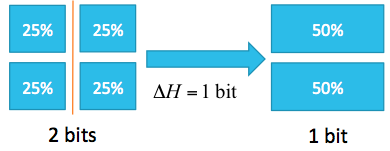
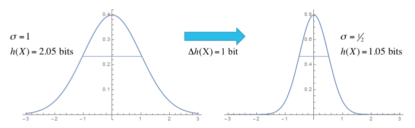

.. _entropy-guide:

*******************
Calculating Entropy
*******************

.. contents:: :local:

Entropy is a measure of how much uncertainty is in the parameters.   We can
start with the simple case of a discrete parameter which can take on limited
set of values. Using the formula for discrete entropy:

.. math::

    H(x) = - \sum_x p(x) \log_2(x)

where $x$ is the set of possible states of the parameter, we can examine a
simple system with four states of equal probability:

Before the experiment, the entropy is $-4 (1/4) \log_2(1/4) = 2$ bits.  After
the experiment, which eliminates the states on the right, only two states are
remaining with an entropy of 1 bit.  The difference in entropy before and
after the experiment is the information gain, which is 1 bit in this case.

Extending this concept to continuous parameters, we use:

.. math::

    h(x) = - \int_{x \in X} p(x) \log_2(x) dx

For a parameter which is normally distributed, $x \sim N(\mu, \sigma)$, the
entropy is:

.. math::

    h(x) = \tfrac12 \log_2 (2 \pi e \sigma^2)

Consider an experiment in which the parameter uncertainty $\sigma$ is reduced
from $\sigma=1$ before the experiment to $\sigma=\tfrac12$ after the
experiment:

This experiment reduces the entropy from 2.05 bits to 1.05 bits, for an
information gain of 1 bit.

For a multivariate normal $N(\bar\mu, \Sigma)$, the entropy is

.. math::

    h(N) = \tfrac{n}{2} \log_2 (2 \pi e) + \tfrac12 \log_2 \lvert \Sigma \rvert

where $n$ is the number of fitting parameters and $\Sigma$ is the
covariance matrix relating the parameters.  For an uncorrelated system, this
is proportional to $\sum_{i=1}^n \log_2 \sigma_i$, with the individual parameter
uncertainties $\sigma_i$. In effect, the entropy is a measure of overall
uncertainty resulting after the fit.

Within bumps, most models start with a uniform prior distribution for the
parameters set using the *x.range(low,high)* or *x.pm(delta)* for some
parameter *x*.  Some models set the prior probability to a normal distribution
using *x.dev(sigma)*.  Arbitrary prior probability distributions can be
set using *x.bounds = Distribution(D)* where *D* is a distribution following
the *scipy.stats* interface.  The uncertainty on the data points does not
directly enter into the entropy calculation.  Instead, it has a direct
influence on the calculation of the probability of seeing the data given
the parameter, and so it influences the probability of the parameters after
the fit.  Increasing the error bars will increase the variance in the
parameter estimation which will increase the entropy.

There are three ways that bumps can evaluate entropy.  For the fitters
which return a sample from the posterior distribution, such as DREAM,
BUMPS can estimate the entropy directly from the sample.  If the distribution
is approximately normal, we can compute the covariance matrix from the sample
and use the formula above for the multivariate normal.   For the remaining
fitters, we can use an estimate of the covariance matrix that results from
the fit (Levenberg-Marquardt, BFGS), or we can compute the Hessian at the
minimum (differential evolution, Nelder-Mead simplex).  Again, this can be
used in the formula above to give an estimate of the entropy.

We can use the difference in entropy between fits for experimental design.
After setting up the model system, we can simulate a dataset using the
expected statistics from the experiment, then fit the simulated data.  This
will give us the the expected uncertainty on our individual parameters, and
the overall entropy.  We can then play with different experimental parameters
such as instrument configurations, sample variants and measurement time and
select a combination which provides the most information about the parameters
of interest.  This can be done from the command line using
:ref:`option-simulate`, :ref:`option-noise` and :ref:`option-entropy`.

The information gain from the fit is not quite meaningful.  We can calculate
the prior entropy by looking at the fitting range of the parameters, and the
particular choice of fitting ranges can alter the output of the fit.  So for
example, if we set the fitting range to eliminate solutions, we will have
reduced the prior entropy as well as the posterior entropy, and likely
decreased the number of bits of information gain.  Conversely, if the fit
converges to the same distribution regardless of the parameter range, we can
drive the information gain to infinity by setting an unbounded input range.
