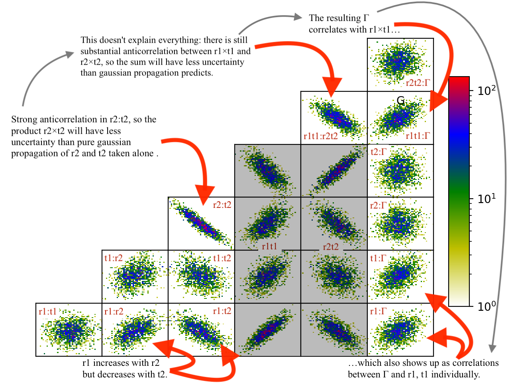

.. _fitting-guide:

*******
Fitting
*******

.. contents:: :local:

Obtaining a good fit depends foremost on having the correct model to fit.

For example, if you are modeling a curve with spline, you will overfit
the data if you have too many spline points, or underfit it if you do not
have enough.  If the underlying data is ultimately an exponential, then
the spline order required to model it will require many more parameters
than the corresponding exponential.

Even with the correct model, there are systematic errors to address
(see :ref:`data-guide`).  A distorted sample can lead to broader resolution
than expected for the measurement technique, and you will need to adjust your
resolution function.  Imprecise instrument control will lead to uncertainty
in the position of the sample, and corresponding changes to the measured
values.  For high precision experiments, your models will need to incorporate
these instrument effects so that the uncertainty in instrument configuration
can be properly accounted for in the uncertainty in the fitted parameter
values.

Quick Fit
=========

While generating an appropriate model, you will want to perform a number
of quick fits.  The :ref:`fit-amoeba` works well for this.  You will want
to run enough iterations ``--steps=1000`` so the algorithm has a
chance to  converge.  Restarting a number of times ``--starts=10`` gives
a reasonably thorough search of the fit space.  Once the fit converges,
additional starts are very quick.  From the graphical user interface, using
``--starts=1`` and clicking the fit button to improve the fit as needed works
pretty well. From the command line interface, the command line will be
something like::

    bumps --fit=amoeba --steps=1000 --starts=20 --parallel model.py --store=T1

Here, the results are kept in a directory ``--store=T1`` relative to the current
directory, with files containing the current model in *model.py*, the fit
result in *model.par* and a plots in *model-\*.png*.  The parallel option
indicates that multiple cores should be used on the cpu when running the fit.

The fit may be able to be improved by using the current best fit value as
the starting point for a new fit::

    bumps --fit=amoeba --steps=1000 --starts=20 --parallel model.py --store=T1 --pars=T1/model.par

If the fit is well behaved, and a numerical derivative exists, then
switching to :ref:`fit-newton` is useful, in that it will very rapidly
converge to a nearby local minimum.

::

    bumps --fit=newton model.py --pars=T1/model.par --store=T1

:ref:`fit-de` is an alternative to :ref:`fit-amoeba`, perhaps a little
more likely to find the global minimum but somewhat slower.  This is a
population based algorithms in which several points from the current
population are selected, and based on the position and value, a new point
is generated.  The population is specified as a multiplier on the number
of parameters in the model, so for example an 8 parameter model with
DE's default population ``--pop=10`` would create 80 points each generation.
This algorithms can be called from the command line as follows::

    bumps --fit=de --steps=3000 --parallel model.py --store=T1

Some fitters save the complete state of the fitter on termination so that
the fit can be resumed.  Use ``--resume=path/to/previous/store`` to resume.
The resumed fit also needs a ``--store=path/to/store``, which could be the
same as the resume path if you want to update it, or it could be a completely
new path.

See :ref:`optimizer-guide` for a description of the available optimizers, and
:ref:`option-guide` for a description of all the bumps options.

Uncertainty Analysis
====================

More important than the optimal value of the parameters is an estimate
of the uncertainty in those values. The best fit is an accident
of the measurement; perform the measurement again and you will get a
different optimum. Given the uncertainty in the measurement, there is a
joint distribution of parameter values that are consistent with the
measurement. For example, when fitting a line, the choice of slope will
affect the range of intercepts that fit the data. The goal of uncertainty
analysis is to determine this distribution and summarize it for the reader.

By casting our problem as the likelihood of seeing the data given the model,
we not only give ourselves the ability to incorporate prior information into
the fit systematically, but we also give ourselves a strong foundation for
assessing the uncertainty of the parameters.

There are multiple ways to perform the analysis:

1. Bayesian inference. Given the probability on the parameters and the
   probability that the measured data will be seen with those parameters,
   infer the probability of the parameters given the measured data.  This
   is the primary method in Bumps and will be discussed at length below.
2. Sensitivity analysis. Given the best fit parameter values, look at the
   curvature around that point as a normal distribution with covariance
   computed from the Hessian matrix. Further, pretend that there is no
   interaction between the parameters (that is they are uncorrelated
   and independent), and report the uncertainty as the square root of the
   diagonal. This is the default method for most optimizers in Bumps.
3. Uncertainty contour. Assuming the measurement data is independent and
   normally distributed, a given increase in $\chi^2$ above the minimum
   corresponds to 1-$\sigma$ confidence interval. By following this contour
   you can find the set of all points $\xi$ such that
   $\chi^2(\xi) = \chi^2(x) + C$ where $x$ is the point of maximum
   likelihood. Look in Numerical Recipes chapter on nonlinear least squares
   for a more complete discussion.  Bumps does not include algorithms
   for this kind of analysis.
4. Forward Monte Carlo. Bumps has the option :ref:`option-resynth` to perform
   a forward Monte Carlo estimate of the maximum likelihood.  That is, you
   can use the measurement uncertainty to "rerun" the experiment, synthesizing
   a new dataset with the same uncertainty but slightly different values,
   then find the new maximum likelihood. After $n$ runs you will be able
   to estimate the uncertainty in the best fit parameters. This method can
   be applied with any of the optimizers.
5. Repeated measurement. A direct way to estimate the parameter uncertainty
   is to repeat the experiment many times and look at the distribution
   of best fit results. This is the classic approach which you need to
   follow if you don't know anything about the uncertainty in your
   measurement processes (other than the assumption of independence between
   measurements).  You can use this during experimental design, simulating the
   experiment in different conditions to figure out the best strategy to
   retrieve the quantity of interest. For example, to plan a reflectometry
   experiment you want to know if it would be better to measure with a pair
   of contrast agents, or to spend twice as long on a single contrast. The
   result gives the expected uncertainty in the parameters before the
   measurement is ever performed. You might call this model driven forward
   Monte Carlo as opposed to the data driven forward MC listed above.

Bayesian inference is performed using :ref:`fit-dream`.  This is a
Markov chain Monte Carlo (MCMC) method with a differential evolution
step generator.  Like simulated annealing, the MCMC explores the space
using a random walk, always accepting a better point, but sometimes
accepting a worse point depending on how much worse it is.

DREAM can be started with a variety of initial populations.  The
random population ``--init=random`` distributes the initial points using
a uniform distribution across the space of the parameters.  Latin
hypersquares ``--init=lhs`` improves on random by making sure that
there is on value for each subrange of every variable. The covariance
population ``--init=cov`` selects points from the uncertainty ellipse
computed from the derivative at the initial point.  This method
will fail if the fitting parameters are highly correlated and the
covariance matrix is singular.  The $\epsilon$-ball population ``--init=eps``
starts DREAM from a tiny region near the initial point and lets it
expand from there.  It can be useful to start with an epsilon ball
from the previous best point when DREAM fails to converge using
a more diverse initial population.

The Markov chain will take time to converge on a stable population.
This burn in time needs to be specified at the start of the analysis.
After burn, DREAM will collect all points visited for N iterations
of the algorithm.  If the burn time was long enough, the resulting
points can be used to estimate uncertainty on parameters.

A common command line for running DREAM is::

   bumps --fit=dream --burn=1000 --samples=1e5 --init=cov --parallel --pars=T1/model.par model.py --store=T2

Bayesian uncertainty analysis is described in the GUM Supplement 1,[8]
and is a valid technique for reporting parameter uncertainties in NIST
publications.   Given sufficient burn time, points in the search space
will be visited with probability proportional to the goodness of fit.
The file T1/model.err contains a table showing for each
parameter the mean(std), median and best values, and the 68% and 95%
credible intervals.  The mean and standard deviation are computed from
all the samples in the returned distribution.  These statistics are not
robust: if the Markov process has not yet converged, then outliers will
significantly distort the reported values.  Standard deviation is
reported in compact notation, with the two digits in parentheses
representing uncertainty in the last two digits of the mean.  Thus, for
example, $24.9(28)$ is $24.9 \pm 2.8$.  Median is the best value in the
distribution.  Best is the best value ever seen.  The 68% and 95%
intervals are the shortest intervals that contain 68% and 95% of
the points respectively.  In order to report 2 digits of precision on
the 95% interval, approximately 1000000 samples drawn from the distribution
are required, or steps = 1000000/(#parameters  #pop).  The 68% interval
will require fewer draws, though how many has not yet been determined.

.. image:: var.png
    :scale: 50

Histogramming the set of points visited will gives a picture of the
probability density function for each parameter.  This histogram is
generated automatically and saved in T1/model-var.png.  The histogram
range represents the 95% credible interval, and the shaded region
represents the 68% credible interval.  The green line shows the highest
probability observed given that the parameter value is restricted to
that bin of the histogram.  With enough samples, this will correspond
to the maximum likelihood value of the function given that one parameter
is restricted to that bin.  In practice, the analysis has converged
when the green line follows the general shape of the histogram.

.. image:: corr.png
    :scale: 50

The correlation plots show that the parameters are not uniquely
determined from the data.  For example, the thickness of
lamellae 3 and 4 are strongly anti-correlated, yielding a 95% CI of
about 1 nm for each compared to the bulk nafion thickness CI of 0.2 nm.
Summing lamellae thickness in the sampled points, we see the overall
lamellae thickness has a CI of about 0.3 nm.  The correlation
plot is saved in T1/model-corr.png.

.. image:: error.png
    :scale: 50

To assure ourselves that the uncertainties produced by DREAM do
indeed correspond to the underlying uncertainty in the model, we perform
a Monte Carlo forward uncertainty analysis by selecting 50 samples from
the computed posterior distribution, computing the corresponding
theory function and calculating the normalized residuals.  Assuming that
our measurement uncertainties are approximately normally distributed,
approximately 68% of the normalized residuals should be within +/- 1 of
the residual for the best model, and 98% should be within +/- 2. Note
that our best fit does not capture all the details of the data, and the
underlying systematic bias is not included in the uncertainty estimates.

Plotting the profiles generated from the above sampling method, aligning
them such that the cross correlation with the best profile is maximized,
we see that the precise details of the lamellae are uncertain but the
total thickness of the lamellae structure is well determined.  Bayesian
analysis can also be used to determine relative likelihood of different
number of layers, but we have not yet performed this analysis.  This plot
is stored in *T1/model-errors.png*.

The trace plot, *T1/model-trace.png*, shows the mixing properties of the
first fitting parameter.  If the Markov process is well behaved, the
trace plot will show a lot of mixing.  If it is ill behaved, and each
chain is stuck in its own separate local minimum, then distinct lines
will be visible in this plot.

The convergence plot, *T1/model-logp.png*, shows the log likelihood
values for each member of the population.  When the Markov process
has converged, this plot will be flat with no distinct lines visible.
If it shows a general upward sweep, then the burn time was not
sufficient, and the analysis should be restarted.  The ability to
continue to burn from the current population is not yet implemented.

Just because all the plots are well behaved does not mean that the
Markov process has converged on the best result.  It is practically
impossible to rule out a deep minimum with a narrow acceptance
region in an otherwise unpromising part of the search space.

In order to assess the DREAM algorithm for suitability for our
problem space we did a number of tests.  Given that our fit surface is
multimodal, we need to know that the uncertainty analysis can return
multiple modes.  Because the fit problems may also be ill-conditioned,
with strong correlations or anti-correlations between some parameters,
the uncertainty analysis needs to be able to correctly indicate that
the correlations exist. Simple Metropolis-Hastings sampling does not
work well in these conditions, but we found that DREAM is able to
handle them.  We are still affected by the curse of dimensionality.
For correlated parameters in high dimensional spaces, even DREAM has
difficulty taking steps which lead to improved likelihood.  For
example, we can recover an eight point spline with generous ranges
on its 14 free parameters close to 100% of the time, but a 10 point
spline is rarely recovered.

Using the posterior distribution
================================

You can load the DREAM output population an perform uncertainty analysis
operations after the fact.  To run an interactive bumps session
use the following::

    bumps -i

First you need to import some functions::

    import os
    import matplotlib.pyplot as plt

    from bumps.dream.state import load_state
    from bumps.dream.views import plot_corrmatrix
    from bumps.dream.stats import var_stats, format_vars
    from bumps.dream.varplot import plot_vars

Then you need to reload the MCMC chains::

    store = "/tmp/t1"   # path to the --store=/tmp/t1 directory
    modelname = "model"  # model file name without .py extension

    # Reload the MCMC data
    basename = os.path.join(store, modelname)
    state = load_state(basename)
    state.mark_outliers() # ignore outlier chains

    # Attach the labels from the .par file:
    with open(basename+".par") as fid:
        state.labels = [" ".join(line.strip().split()[:-1]) for line in fid]

Now you can plot the data::

    state.show()  # Create the standard plots

You can choose to plot only some of the variables::

    # Select the data to plot (the 3rd and the last two in this case):
    draw = state.draw(vars=[2, -2, -1])

    # Histograms
    stats = var_stats(draw)  # Compute statistics such as the 90% interval
    print(format_vars(stats))
    plt.figure()
    plot_vars(draw, stats)

    # Correlation plots
    plt.figure()
    plot_corrmatrix(draw)

You can restrict those variables to a certain range. For example, to
restrict the third parameter to $[0.8,1.0]$ and the last to $[0.2,0.4]$::

    from bumps.dream import views
    selection={2: (0.8,1.0), -1:(0.2,0.4),...}
    draw = state.draw(vars=[2, -2, -1], selection=selection)
    ...

You can add create derived variables using a function to generate the new
variable from some combination of existing variables.  For example, to add
the first two variables together to create the derived variable "x+y" use::

    state.derive_vars(lambda p: p[0]+p[1], labels=["x+y"])

You can generate multiple derived parameters at a time with a function
that returns a sequence::

    state.derive_vars(lambda p: (p[0]*p[1],p[0]-p[1]), labels=["x*y","x-y"])

These new parameters will show up in the plots::

    state.show()

Here is an example from a fit to bovine serum albumin with a two layer model.
The parameter of interest ($\Gamma$) is derived from the SLD $\rho$ and
thickness $t$ of the constituent layers using
$\Gamma = 0.06955(\rho_1 t_1 + \rho_2 t_2)$.
Using intermediate values for $\rho_1 t_1$ and $\rho_2 t_2$ to show the
difference between gaussian error propagation and full correlation analysis,
the derived parameters as set up as follows::

    from bumps.dream.state import load_state
    state = load_state("1000ppm_Ph4.9 NRW_0M_2layer model")
    state.labels = ["r1", "t1", "r2", "t2"]
    state.derive_vars(lambda p: (p[0]*p[1],p[2]*p[3],0.06955*(p[0]*p[1]+p[2]*p[3])),
                      labels=["r1t1","r2t2","G"])
    state.show()

This gives the following output::

      Parameter    mean     median    best [   68% interval] [   95% interval]
    1        r1 0.3321(98)  0.3322  0.3327 [  0.322   0.342] [  0.312   0.351]
    2        t1  50.37(89)  50.381  50.286 [  49.47   51.21] [  48.49   52.21]
    3        r2  1.199(22)  1.1976  1.1980 [  1.177   1.224] [  1.158   1.242]
    4        t2  24.90(80)  24.892  24.901 [  24.06   25.76] [  23.37   26.44]
    5      r1t1  16.73(58)  16.712  16.729 [  16.16   17.30] [  15.61   17.86]
    6      r2t2  29.84(48)  29.863  29.832 [  29.36   30.33] [  28.87   30.78]
    7         G  3.239(27)   3.238   3.238 [   3.21    3.27] [   3.19    3.29]

Using simple gaussian propagation of errors (from the wonderfully
convenient uncertainties package) can compare the computed uncertainties::

    from uncertainties import ufloat as U
    C = 0.06955
    r1t1 = U(0.3321, 0.0098) * U(50.37, 0.89)
    r2t2 = U(1.199, 0.022) * U(24.90, 0.80)
    G = C*(r1t1 + r2t2)
    print("r1*t1 =", r1t1)
    print("r2*t2 =", r2t2)
    print("G =", C*(r1t1 + r2t2))

which produces::

    r1*t1 = 16.7 ± 0.6   # same as forward MC
    r2*t2 = 29.9 ± 1.1   # compared to 29.8 ± 0.5 from forward MC
    G = 3.24 ± 0.09      # compared to 3.24 ± 0.03 from forward MC

That is, the gaussian approximation assuming uncorrelated uncertainties is
3x larger than the forward Monte Carlo approximation from the joint
distribution of the fitted parameters. Much of the reduction comes from
the strong negative correlation between $\rho_2$ and $t_2$, with the remainder
coming from the negative correlation between the products
$\rho_1 t_1$ and $\rho_2 t_2$.

You can see this in the correlation plots, with r2:t2 having a very narrow
diagonal (hence strong correlation) and r1t1:r2×t2 having a somewhat wider
diagonal (hence weaker correlation).

The plotting code is somewhat complicated, and matplotlib doesn't have a
good way of changing plots interactively.  If you are running directly
from the source tree, you can modify the dream plotting libraries as you
need for a one-off plot, then replot the graph::

    # ... change the plotting code in dream.views/dream.corrplot
    reload(dream.views)
    reload(dream.corrplot)
    state.show()

Be sure to restore the original versions when you are done.  If the change
is so good that everyone should use it, be sure to feed it back to the
community via the bumps source control system at
`github <https://github.com/bumps>`_.

Publication Graphics
====================

The matplotlib package is capable of producing publication quality
graphics for your models and fit results, but it requires you to write
scripts to get the control that you need.  These scripts can be run
from the Bumps application by first loading the model and the fit
results then accessing their data directly to produce the plots that
you need.

The model file (call it *plot.py*) will start with the following::

    import sys
    from bumps.cli import load_problem, load_best

    model, store = sys.argv[1:3]

    problem = load_problem([model])
    load_best(problem, os.path.join(store, model[:-3]+".par"))
    chisq = problem.chisq

    print("chisq", chisq)

Assuming your model script is in model.py and you have run a fit with
``--store=X5``, you can run this file using::

    $ bumps plot.py model.py X5

Now *model.py* is loaded and the best fit parameters are set.

To produce plots, you will need access to the data and the theory.  This
can be complex depending on how many models you are fitting and how many
datasets there are per model.  For single experiment models defined
by :func:`FitProblem <bumps.fitproblem.FitProblem>`, your original
experiment object  is referenced by *problem.fitness*.  For simultaneous
refinement defined by *FitProblem* with multiple *Fitness* objects,
use ``problem.models[k].fitness`` to access the experiment for
model *k*.  Your experiment object should provide methods for retrieving
the data and plotting data vs. theory.

How does this work in practice?  Consider the reflectivity modeling
problem where we have a simple model such as nickel film on a silicon
substrate.  We measure the specular reflectivity as various angles and
try to recover the film thickness.  We want to make sure that our
model fits the data within the uncertainty of our measurements, and
we want some graphical representation of the uncertainty in our film
of interest.  The refl1d package provides tools for generating the
sample profile uncertainty plots.  We access the experiment information
as follows::

    experiment = problem.fitness
    z,rho,irho = experiment.smooth_profile(dz=0.2)
    # ... insert profile plotting code here ...
    QR = experiment.reflectivity()
    for p,th in self.parts(QR):
        Q,dQ,R,dR,theory = p.Q, p.dQ, p.R, p.dR, th[1]
        # ... insert reflectivity plotting code here ...

Next we can reload the the error sample data from the DREAM MCMC sequence::

    import dream.state
    from bumps.errplot import calc_errors_from_state, align_profiles

    state = load_state(os.path.join(store, model[:-3]))
    state.mark_outliers()
    # ... insert correlation plots, etc. here ...
    profiles,slabs,Q,residuals = calc_errors_from_state(problem, state)
    aligned_profiles = align_profiles(profiles, slabs, 2.5)
    # ... insert profile and residuals uncertainty plots here ...

The function :func:`bumps.errplot.calc_errors_from_state` calls the
calc_errors function defined by the reflectivity model.  The return value is
arbitrary, but should be suitable for the show_errors function defined
by the reflectivity model.

Putting the pieces together, here is a skeleton for a specialized
plotting script::

    import sys
    import pylab
    from bumps.dream.state import load_state
    from bumps.cli import load_problem, load_best
    from bumps.errplot import calc_errors_from_state
    from refl1d.align import align_profiles

    model, store = sys.argv[1:3]

    problem = load_problem([model])
    load_best(problem, os.path.join(store, model[:-3]+".par"))

    chisq = problem.chisq
    experiment = problem.fitness
    z,rho,irho = experiment.smooth_profile(dz=0.2)
    # ... insert profile plotting code here ...
    QR = experiment.reflectivity()
    for p,th in self.parts(QR):
        Q,dQ,R,dR,theory = p.Q, p.dQ, p.R, p.dR, th[1]
        # ... insert reflectivity plotting code here ...

    if 1:  # Loading errors is expensive; may not want to do so all the time.
        state = load_state(os.path.join(store, model[:-3]))
        state.mark_outliers()
        # ... insert correlation plots, etc. here ...
        profiles,slabs,Q,residuals = calc_errors_from_state(problem, state)
        aligned_profiles = align_profiles(profiles, slabs, 2.5)
        # ... insert profile and residuals uncertainty plots here ...

    pylab.show()
    raise Exception()  # We are just plotting; don't run the model

Tough Problems
==============

.. note::

   DREAM is currently our most robust fitting algorithm.  We are
   exploring other algorithms such as parallel tempering, but they
   are not currently competitive with DREAM.

With the toughest fits, for example freeform models with arbitrary
control points, DREAM only succeeds if the model is small or the
control points are constrained.  We have developed a parallel
tempering (fit=pt) extension to DREAM.  Whereas DREAM runs with a
constant temperature, $T=1$, parallel tempering runs with multiple
temperatures concurrently.   The high temperature points are able to
walk up steep hills in the search space, possibly crossing over into a
neighbouring valley.  The low temperature points agressively seek the
nearest local minimum, rejecting any proposed point that is worse than
the current.  Differential evolution helps adapt the steps to the shape
of the search space, increasing the chances that the random step will be
a step in the right direction.  The current implementation uses a fixed
set of temperatures defaulting to ``--Tmin=0.1`` through ``--Tmax=10`` in
``--nT=25`` steps; future versions should adapt the temperature based
on the fitting problem.

Parallel tempering is run like dream, but with optional temperature
controls::

   bumps --fit=dream --burn=1000 --samples=1e5 --init=cov --parallel --pars=T1/model.par model.py --store=T2

Parallel tempering does not yet generate the uncertainty plots provided
by DREAM.  The state is retained along the temperature for each point,
but the code to generate histograms from points weighted by inverse
temperature has not yet been written.

Parallel tempering performance has been disappointing.  In theory it
should be more robust than DREAM, but in practice, we are using a
restricted version of differential evolution with the population
defined by the current chain rather than a set of chains running in
parallel.  When the Markov chain has converged these populations
should be equivalent, but apparently this optimization interferes
with convergence.  Time permitting, we will improve this algorithm
and look for other ways to improve upon the robustness of DREAM.

Command Line
============

The GUI version of Bumps is slower because it frequently updates the graphs
showing the best current fit.

Run multiple models overnight, starting one after the last is complete
by creating a batch file (e.g., run.bat) with one line per model.  Append
the parameter --batch to the end of the command lines so the program
doesn't stop to show interactive graphs::

    bumps model.py ... --parallel --batch

You can view the fitted results in the GUI the next morning using::

    bumps --edit model.py --pars=T1/model.par
