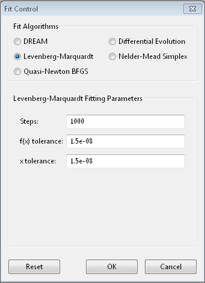
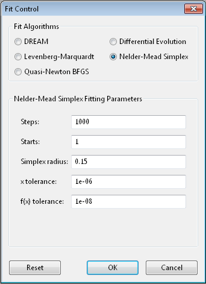
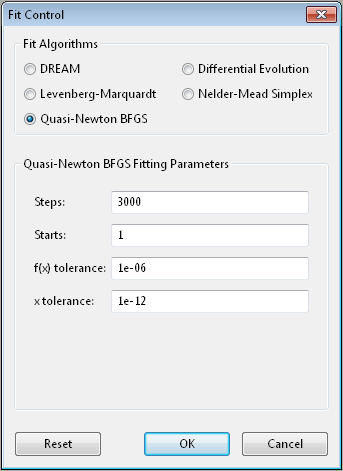
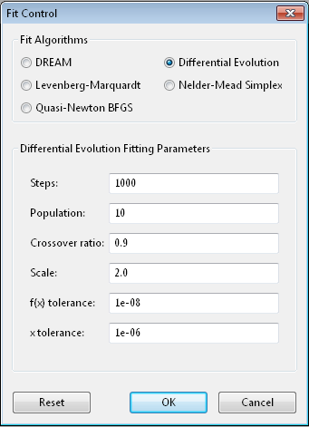
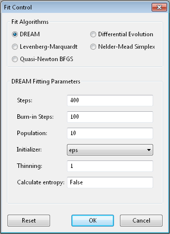
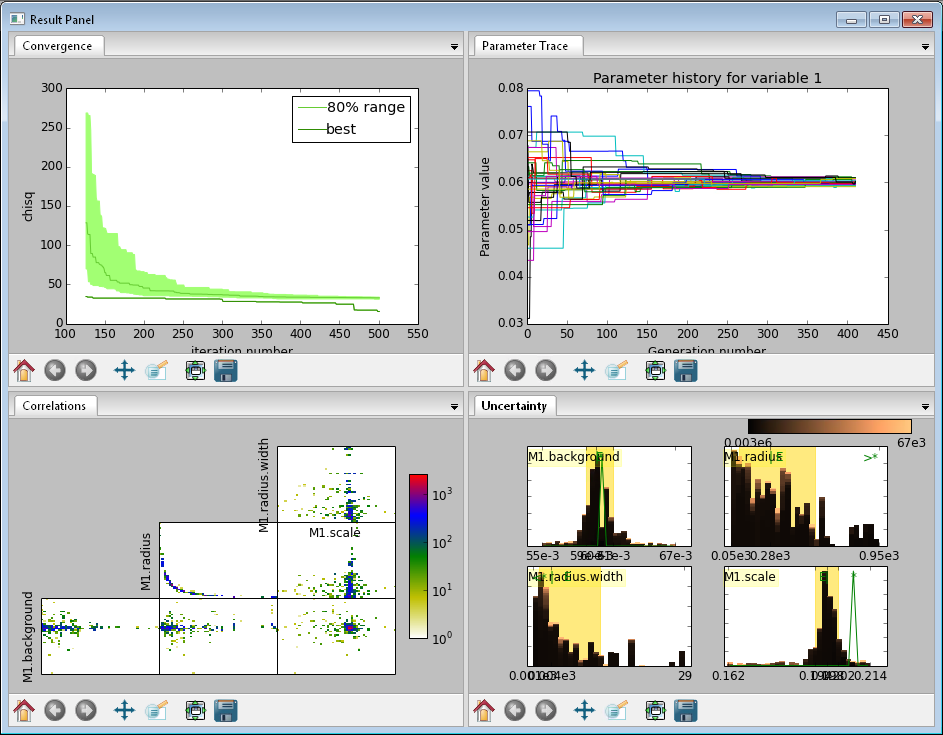
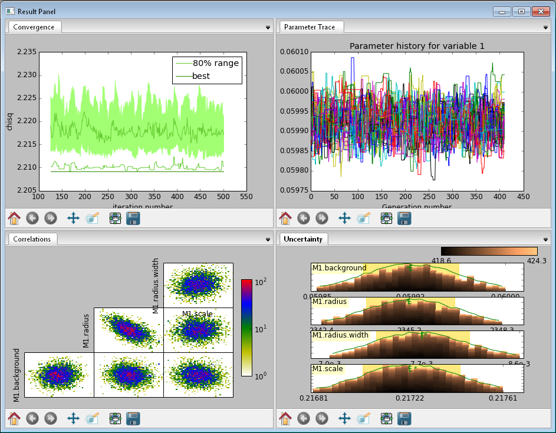

.. _optimizer-guide:

*******************
Optimizer Selection
*******************

Bumps has a number of different optimizers available, each with its own
control parameters:

* :ref:`fit-lm`
* :ref:`fit-amoeba`
* :ref:`fit-dream`
* :ref:`fit-de`
* :ref:`fit-newton`
* :ref:`fit-rl` [experimental]
* :ref:`fit-ps` [experimental]
* :ref:`fit-pt` [experimental]

In general there is a trade-off between convergence
rate and robustness, with the fastest algorithms most likely to find a
local minimum rather than a global minimum.   The gradient descent algorithms
(:ref:`fit-lm`, :ref:`fit-newton`) tend to be fast but they will find local
minima only, while the population algorithms (:ref:`fit-dream`, :ref:`fit-de`)
are more robust and likely slower.   :ref:`fit-amoeba` is somewhere between,
with a small population keeping the search local but more robust than the
gradient descent algorithms.

Each algorithm has its own set of control parameters for adjusting the
search process and the stopping conditions.  The same option may mean
slightly different things to different optimizers.  The bumps package
provides a dialog box for selecting the optimizer and its options
when running the fit wx application.  This only includes the common options
for the most useful optimizers.  For full control, the fit will need to
be run from the command line interface or through a python script.

For parameter uncertainty, most algorithms use the covariance matrix at
the optimum to estimate an uncertainty ellipse.  This is okay for a
preliminary analysis, but only works reliably for weakly correlated parameters.
For full uncertainty analysis, :ref:`fit-dream` uses a random walk to explore
the parameter space near the minimum, showing pair-wise correlations
amongst the parameter values.  In order for :ref:`fit-dream` to return the
correct uncertainy, the function to be optimized should be a conditional
probability density, with *nllf* as the negative log likelihood function
of seeing point $x$ in the parameter space.  Other functions
can be fitted, but uncertainty estimates will be meaningless.

Most algorithms have been adapted to run in parallel at least to some degree.
The  implementation is not heavily tuned, either in terms of minimizing the
overhead per function evaluation or for distributing the problem across
multiple processors.   If the theory function is implemented in parallel,
then the optimizer should be run in serial.  Mixed mode is also possible
when running on a cluster with a multi-threaded theory function.  In this
case, only one theory function will be evaluated on each cluster node, but
the optimizer will distribute the parameters values to the cluster nodes
in parallel.  Do not run serial algorithms (:ref:`fit-lm`, :ref:`fit-newton`) on
a cluster.

We have included a number of optimizers in Bumps that did not perform
particularly well on our problem sets.  However, they may be perfect
for your problem, so we have left them in the package for you to explore.
They are not available in the GUI selection.

.. _fit-lm:

Levenberg-Marquardt
===================

The Levenberg-Marquardt algorithm has been
the standard method for non-linear data fitting.  As a gradient descent
trust region method, it starts at the initial value of the function and
steps in the direction of the derivative until it reaches the minimum.
Set up as an explicit minimization of the sum of square differences between
theory and model, it uses a numerical approximation of the Jacobian matrix
to set the step direction and an adaptive algorithm to set the size of
the trust region.

When to use
-----------

Use this method when you have a reasonable fit near the minimum, and
you want to get the best possible value.  This can then be used as the starting
point for uncertainty analysis using :ref:`fit-dream`.  This method requires
that the problem definition includes a *residuals* method, but this should
always be true when fitting data.

When modeling the results of an experiment, the best fit value is an
accident of the measurement.  Redo the same measurement, and the slightly
different values you measure will lead to a different best fit.  The
important quantity to report is the credible interval covering
68%  (1-\ $\sigma$) or 95% (2-\ $\sigma$\ ) of the range of
parameter values that are somewhat consistent with the data.

This method uses *lmfit* from *scipy*, and does not run in parallel.

Options
-------

*Steps* is the number of gradient steps to take.  Each step requires
a calculation of the Jacobian matrix to determine the direction.  This
needs $2 m n$ function evaluations, where $n$ is the number of parameters and
each function is evaluated and $m$ data points (assuming center point
formula for finite difference estimate of the derivative).  The resulting
linear equation is then solved, but for small $n$ and expensive function
evaluation this overhead can be ignored.  Use ``--steps=n`` from
the command line.

*f(x) tolerance* and *x tolerance* are used to determine when
the fit has reached the point where no significant improvement is expected.
If the function value does not improve significantly within the step, or
the step is too short, then the fit will terminate.  Use ``--ftol=v`` and
``--xtol=v`` from the command line.

From the command line, ``--starts=n`` will automatically restart the algorithm
after it has converged so that a slightly better value can be found. If
``--keep_best`` is included then restart will use a value near the minimum,
otherwise it will restart the fit from a random point in the parameter space.

Use ``--fit=lm`` to select the Levenberg-Marquardt fitter from the command line.

References
----------

.. [Levenberg1944]
    Levenberg, K.
    *Quarterly Journal of Applied Mathmatics*
    1944, II (2), 164–168.

.. [Marquardt1963]
    Marquardt, D. W.
    *Journal of the Society for Industrial and Applied Mathematics*
    1963, 11 (2), 431–441.
    DOI: `10.1137/0111030 <http://dx.doi.org/10.1137/0111030>`_

.. _fit-amoeba:

Nelder-Mead Simplex
===================

The Nelder-Mead downhill simplex algorithm is a robust optimizer which
does not require the function to be continuous or differentiable.
It uses the relative values of the function at the corners of a
simplex (an n-dimensional triangle) to decide which points of the simplex
to update.  It will take the worst value and try moving it inward or
outward, or reflect it through the centroid of the remaining values
stopping if it finds a better value.  If none of these values are
better, then it will shrink the simplex and start again.  The name
amoeba comes from the book *Numerical Recipes* [Press1992]_ wherein they
describe the search as acting like an amoeba, squeezing through narrow valleys
as it makes its way down to the minimum.

When to use
-----------

Use this method as a first fit to your model.  If your fitting function
is well behaved with few local minima this will give a quick estimate of
the model, and help you decide if the model needs to be refined.  If your
function is poorly behaved, you will need to select a good initial value
before fitting, or use a more robust method such
as :ref:`fit-de` or :ref:`fit-dream`.

The uncertainty reported comes from a numerical derivative estimate at the
minimum.

This method requires a series of function updates, and does not benefit
much from running in parallel.

Options
-------

*Steps* is the simplex update iterations to perform.  Most updates
require one or two function evaluations, but shrinking the simplex evaluates
every value in the simplex. Use ``--steps=n`` from the command line.

*Starts* tells the optimizer to restart a given number of times.
Each time it restarts it uses a random starting point.   Use
``--starts=n`` from the command line.

*Simplex radius* is the initial size of the simplex, as a portion of
the bounds defining the parameter space.  If a parameter is unbounded, then
the radius will be treated as a portion of the parameter value. Use
``--radius=n`` from the command line.

*x tolerance* and *f(x) tolerance* are used to determine when the
fit has reached the point where no significant improvement is expected.
If the simplex is tiny (that is, the corners are close to each other) and
flat (that is, the values at the corners are close to each other),
then the fit will terminate.  Use ``--xtol=v`` and ``--ftol=v`` from
the command line.

From the command line, use ``--keep_best`` so that restarts are centered on a
value near the minimum rather than restarting from a random point within the
parameter bounds.

Use ``--fit=amoeba`` to select the Nelder-Mead simplex fitter from the
command line.

References
----------

.. [Nelder1965]
    Nelder, J. A.; Mead, R.
    *The Computer Journal*
    1965, 7 (4), 308–313.
    DOI: `10.1093/comjnl/7.4.308 <http://dx.doi.org/10.1093/comjnl/7.4.308>`_

.. [Press1992]
   Press, W. H.; Flannery, B. P.; Teukolsky, S. A.; Vetterling, W. T.
   In *Numerical Recipes in C: The Art of Scientific Computing, Second Edition*;
   Cambridge University Press: Cambridge; New York, 1992; pp 408–412.

.. _fit-newton:

Quasi-Newton BFGS
=================

Broyden-Fletcher-Goldfarb-Shanno is a gradient descent method which uses the
gradient to determine the step direction and an approximation of the Hessian
matrix to estimate the curvature and guess a step size.  The step is further
refined with a one-dimensional search in the direction of the gradient.

When to use
-----------

Like :ref:`fit-lm`, this method converges quickly to the minimum.  It does
not assume that the problem is in the form of a sum of squares and does not
require a *residuals* method.

The $n$ partial derivatives are computed in parallel.

Options
-------

*Steps* is the number of gradient steps to take.  Each step requires
a calculation of the Jacobian matrix to determine the direction.  This
needs $2 m n$ function evaluations, where $n$ is the number of parameters and
each function is evaluated and $m$ data points (assuming center point
formula for finite difference estimate of the derivative).  The resulting
linear equation is then solved, but for small $n$ and expensive function
evaluation this overhead can be ignored.
Use ``--steps=n`` from the command line.

*Starts* tells the optimizer to restart a given number of times.
Each time it restarts it uses a random starting point.
Use ``--starts=n`` from the command line.

*f(x) tolerance* and *x tolerance* are used to determine when
the fit has reached the point where no significant improvement is expected.
If the function is small or the step is too short then the fit
will terminate.  Use ``--ftol=v`` and ``--xtol=v`` from the command line.

From the command line, ``--keep_best`` uses a value near the previous minimum
when restarting instead of using a random value within the parameter bounds.

Use ``--fit=newton`` to select BFGS from the commandline.

References
----------

.. [Dennis1987]
    Dennis, J. E.; Schnabel, R. B.
    *Numerical Methods for Unconstrained Optimization and Nonlinear Equations*;
    Society for Industrial and Applied Mathematics: Philadelphia, 1987.

.. _fit-de:

Differential Evolution
======================

Differential evolution is a population based algorithm which uses differences
between points as a guide to selecting new points.  For each member of the
population a pair of points is chosen at random, and a difference vector is
computed.  This vector is scaled, and a random subset of its components are
added to the current point based on crossover ratio. This new point is
evaluated, and if its value is lower than the current point, it replaces
it in the population.   There are many variations available within DE that
have not been exposed in Bumps.  Interested users can modify
:class:`bumps.fitters.DEFit` and experiment with different crossover and
mutation algorithms, and perhaps add them as command line options.

Differential evolution is a robust directed search strategy.  Early in the
search, when the population is disperse, the difference vectors are large
and the search remains broad.  As the search progresses, more of the
population goes into the valleys and eventually all the points end up in
local minima.  Now the differences between random pairs will often be small
and the search will become more localized.

The population is initialized according to the prior probability distribution
for each each parameter.  That is, if the parameter is bounded, it will use
a uniform random number generate within the bounds.  If it is unbounded, it
will use a uniform value in [0,1].  If the parameter corresponds to the result
of a previous measurement with mean $\mu$ and standard deviation $\sigma$,
then the initial values will be pulled from a gaussian random number generator.

When to use
-----------

Convergence with differential evolution will be slower, but more robust.

Each update will evaluate $k$ points in parallel, where $k$ is the size
of the population.

Options
-------

*Steps* is the number of iterations.  Each step updates each member
of the population.  The population size scales with the number of fitted
parameters. Use ``--steps=n`` from the command line.

*Population* determines the size of the population.  The number of
individuals, $k$, is equal to the number of fitted parameters times the
population scale factor.  Use ``--pop=k`` from the command line.

*Crossover ratio* determines what proportion of the dimensions to update
at each step.  Smaller values will likely lead to slower convergence, but
more robust results.  Values must be between 0 and 1.  Use ``--CR=v`` from
the command line.

*Scale* determines how much to scale each difference vector before adding
it to the candidate point.  The selected mutation algorithm chooses a scale
factor uniformly in $[0,F]$.  Use ``--F=v`` from the command line.

*f(x) tolerance* and *x tolerance* are used to determine when the
fit has reached the point where no significant improvement is expected.
If the population is flat (that is, the minimum and maximum values are
within tolerance) and tiny (that is, all the points are close to each
other) then the fit will terminate.  Use ``ftol=v`` and ``xtol=v`` from the
command line.

Use ``--fit=de`` to select diffrential evolution from the commandline.

References
----------

.. [Storn1997]
    Storn, R.; Price, K.
    *Journal of Global Optimization*
    1997, 11 (4), 341–359.
    DOI: `10.1023/A:1008202821328 <http://dx.doi.org/10.1023/A:1008202821328>`_

.. _fit-dream:

DREAM
=====

DREAM is a population based algorithm like differential evolution, but
instead of only keeping individuals which improve each generation, it
will sometimes keep individuals which get worse.  Although it is not
fast and does not give the very best value for the function, we have
found it to be a robust fitting engine which will give a good value given
enough time.

The progress of each individual in the population from generation to
generation can considered a Markov chain, whose transition probability
is equal to the probability of taking the step times the probability
that it keeps the step based on the difference in value between the points.
By including a purely random stepper with some probability, the detailed
balance condition is preserved, and the Markov chain converges onto
the underlying equilibrium distribution.  If the theory function represents
the conditional probability of selecting each point in the parameter
space, then the resulting chain is a random draw from the posterior
distribution.

This means that the DREAM algorithm can be used to determine the parameter
uncertainties.  Unlike the hessian estimate at the minimum that is
used to report uncertainties from the other fitters, the resulting
uncertainty need not gaussian.  Indeed, the resulting distribution can
even be multi-modal.  Fits to measured data using theory functions that
have symmetric solutions have shown all equivalent solutions with approximately
equal probability.

When to use
-----------

Use DREAM when you need a robust fitting algorithm.  It takes longer but
it does an excellent job of exploring different minima and getting close
to the global optimum.

Use DREAM when you want a detailed analysis of the parameter uncertainty.

Like differential evolution, DREAM will evaluate $k$ points in parallel,
where $k$ is the size of the population.

Options
-------

*Samples* is the number of points to be drawn from the Markov chain.
To estimate the 68% interval to two digits of precision, at least
1e5 (or 100,000) samples are needed.  For the 95% interval, 1e6
(or 1,000,000) samples are needed.  The default 1e4 samples
gives a rough approximation of the uncertainty relatively quickly.
Use ``--samples=n`` from the command line.

*Burn-in Steps* is the number of iterations to required for the Markov
chain to converge to the equilibrium distribution.  If the fit ends
early, the tail of the burn will be saved to the start of the steps.
Use ``--burn=n`` from the command line.

*Population* determines the size of the population.  The number of
individuals, $k$, is equal to the number of fitted parameters times the
population scale factor.  Use ``--pop=k`` from the command line.

*Initializer* determines how the population will be initialized.
The options are as follows:

     *eps* (epsilon ball), in which the entire initial population is chosen
     at random from within a tiny hypersphere centered about the initial point

     *lhs* (latin hypersquare), which chops the bounds within each dimension
     in $k$ equal sized chunks where $k$ is the size of the population and
     makes sure that each parameter has at least one value within each chunk
     across the population.

     *cov* (covariance matrix), in which the uncertainty is estimated using
     the covariance matrix at the initial point, and points are selected
     at random from the corresponding gaussian ellipsoid

     *random* (uniform random), in which the points are selected at random
     within the bounds of the parameters

Use ``--init=type`` from the command line.

*Thinning* is the amount of thinning to use when collecting the
population.  If the fit is somewhat stuck, with most steps not improving
the fit, then you will need to thin the population to get proper
statistics.  Use ``--thin=k`` from the command line.

*Calculate entropy*, if true, computes the entropy for the fit.  This is
an estimate of the amount of information in the data.  Use ``--entropy``
from the command line.

*Steps*, if not zero, determines the number of iterations to use for
drawing samples after burn in. Each iteration updates the full population,
which is (population x number of fitted parameters) points. This option
is available for compatibility; it is more useful to set the number of
samples directly.  Use ``--steps=n`` from the command line.

Use ``--fit=dream`` to select DREAM from the commandline.

Output
------

DREAM produces a number of different outputs, and there are a number of
things to check before using its reported uncertainty values.  The main
goal of selecting ``--burn=n`` is to wait long enough to reach the
equilibrium distribution.

    This DREAM fit is incomplete, as can be seen on all four plots.  The
    *Convergence* plot is still decreasing, *Parameter Trace* plot does not
    show random mixing of Markov chain values, the *Correlations* plots are
    fuzzy and mostly empty, the *Uncertainty* plot shows black histograms
    (indicating that there are a few stray values far away from the best) and
    green maximum likelihood spikes not matching the histogram (indicating
    that the region around the best value has not been adequately explored).

    This DREAM fit completed successfully.  The *Convergence* plot is flat,
    the *Parameter Trace* plot is flat and messy, the *Correlateions* plots
    show nice blobs (and a bit of correlation between the *M1.radius* parameter
    and the *M1.radius.width* parameter), and the uncertainty plots show
    a narrow range of -log(P) values in the mostly brown histograms and
    a good match to the green constrained maximum likelihood line.

For each parameter in the fit, DREAM finds the mean, median and best value,
as well as the 68% and 95% credible intervals.  The mean value is
defined as $\int x P(x) dx$, which is just the expected value of the
probability distribution for the parameter.  The median value is the 50%
point in the probability distribution, and the best value is the maximum
likelihood value seen in the random walk.  The credible intervals are the
central intervals which capture 68% and 95% of the parameter values
respectively.  You need approximately 100,000 samples to get two digits of
precision on the 68% interval, and 1,000,000 samples for the 95% interval.

.. table:: Example fit output

    = =============== ============ ======== ======== ================= =================
    #  Parameter         mean       median    best   [   68% interval] [   95% interval]
    = =============== ============ ======== ======== ================= =================
    1   M1.background 0.059925(41) 0.059924 0.059922 [0.05988 0.05997] [0.05985 0.06000]
    2       M1.radius   2345.3(15) 2345.234 2345.174 [2343.83 2346.74] [2342.36 2348.29]
    3 M1.radius.width  0.00775(41)  0.00774  0.00777 [ 0.0074  0.0081] [ 0.0070  0.0086]
    4        M1.scale  0.21722(20) 0.217218 0.217244 [0.21702 0.21743] [0.21681 0.21761]
    = =============== ============ ======== ======== ================= =================

The *Convergence* plot shows the range of $\chi^2$ values in the population
for each iteration.  The band shows the 68% of values around the median, and
the solid line shows the minimum value.  If the distribution has reached
equilibrium, then convergence graph should be roughly flat, with little
change in the minimum value throughout the graph.  If there is no convergence,
then the remaining plots don't mean much.

The *Correlations* plot shows cross correlation between each pair of
parameters.  If the parameters are completely uncorrelated then the boxes
should contain circles.  Diagonals indicate strong correlation.  Square
blocks indicate that the fit is not sensitive to one of the parameters.
The range plotted on the correlation plot is determined by the 95% interval
of the data.  The individual correlation plots are too small to show the
range of values for the parameters.  These can instead be read from the
*Uncertainty* plot for each parameter, which covers the same range of values
and indicates 68% and 95% intervals.  If there are some chains that are
wandering around away from the minimum, then the plot will look fuzzy, and
not have a nice blob in the center.  If a correlation plot has multiple blobs,
then there are multiple minima in your problem space, usually because there
are symmetries in the problem definition.  For example, a model fitting
$x + a^2$ will have identical solutions for $\pm\,a$.

The *Uncertainty* plot shows histograms for each fitted parameter generated
from the values for that parameter across all chains.  Within each histogram
bar the values are sorted and displayed as a gradient from black to copper,
with black values having the lowest $\chi^2$ and copper values having the
highest.  The resulting histogram should be dark brown, with a black hump
in the center and light brown tips.  If there are large lumps of light brown,
or excessive black then its likely that the optimizer did not converge.  The
green line over the histogram shows the best value seen within each
histogram bin (the maximum likelihood given $p_k == x$).
With enough samples and proper convergence, it should roughly follow the
outline of the histogram.  The yellow band in the center of the plot
represents the 68% interval for the data.  The histogram cuts off at 95%.
These values along with the median are shown as labels along the x axis.
The green asterisk represents the best value, the green *E* the mean value
and the vertical green line the median value.  If the fit is not sensitive
to a parameter, or if two parameters are strongly correlated, the parameter
histogram will show a box rather than a hump.  Spiky shapes (either in the
histogram or the maximum likelihood line) indicate lack of convergence or
maybe not enough steps.  A chopped histograms indicates that the range for
that parameter is too small.

The *Parameter Trace* plot is diagnostic for models which have poor mixing.
In this cases no matter how the parameter values are changing, they are
landing on much worse values for the $\chi^2$.  This can happen if the
problem is highly constrained with many tight and twisty values.

The *Data and Theory* plot should show theory and data lining up pretty well,
with the theory overlaying about 2/3 of the error bars on the data
(1-\ $\sigma$ = 68%).  The *Residuals* plot shows the difference between
theory and data divided by uncertainty.  The residuals should be 2/3 within
[-1, 1], They should not show any structure, such as humps where the theory
misses the data for long stretches.  This indicates some feature missing
from the model, or a lack of convergence to the best model.

If entropy is requested, then bumps will show the total number of bits of
information in the fit.  This derives from the entropy term:

.. math:

    S = \int_\Theta p(\Theta) \log p(\Theta) d\Theta

Using entropy and simulation we hope to be able to make experiment
planning decisions in a way that maximizes information, by estimating
whether it is better to measure more precisely or to measure different
but related values and fit them with shared parameters.

References
----------

.. [Vrugt2009]
    Vrugt, J. A.; Ter Braak, C. J. F.; Diks, C. G. H.; Robinson, B. A.;
    Hyman, J. M.; Higdon, D.
    *International Journal of Nonlinear Sciences and Numerical Simulation*
    2009, 10 (3), 273–290.
    DOI: `10.1515/IJNSNS.2009.10.3.273 <http://dx.doi.org/10.1515/IJNSNS.2009.10.3.273>`_

.. [Kramer2010]
    Kramer, A.; Hasenauer, J.; Allgower, F.; Radde, N.
    *In 2010 IEEE International Conference on Control Applications (CCA)*
    2010; pp 493–498.
    DOI: `10.1109/CCA.2010.5611198 <http://dx.doi.org/10.1109/CCA.2010.5611198>`_

.. [JCGM2008]
    JCGM.
    *Evaluation of measurement data — Supplement 1 to the “Guide to the
    expression of uncertainty in measurement” — Propagation of distributions
    using a Monte Carlo method*; Joint Committee for Guides in Metrology,
    JCGM 101:2008; Geneva, Switzerland, 2008; p 90.
    `<http://www.bipm.org/utils/common/documents/jcgm/JCGM_101_2008_E.pdf>`_

.. _fit-ps:

Particle Swarm
==============

Inspired by bird flocking behaviour, the particle swarm algorithm is a
population-based method which updates an individual according to its
momentum and a force toward the current best fit parameter values.  We
did not explore variations of this algorithm in any detail.

When to use
-----------

Particle swarm performed well enough in our low dimensional test problems,
but made little progress when more fit parameters were added.

The population updates can run in parallel, but the tiny population size
limits the amount of parallelism.

Options
-------

``--steps=n`` is the number of iterations.  Each step updates each member
of the population.  The population size scales with the number of fitted
parameters.

``--pop=k`` determines the size of the population.  The number of
individuals, $k$, is equal to the number of fitted parameters times the
population scale factor.  The default scale factor is 1.

Use ``--fit=ps`` to select particle swarm from the commandline.

Add a few more lines

References
----------

.. [Kennedy1995]
    Kennedy, J.; Eberhart, R.
    Particle Swarm Optimization
    *Proceedings of IEEE International Conference on Neural Networks. IV.*
    1995; pp 1942–1948.
    DOI: `10.1109/ICNN.1995.48896 <http://dx.doi.org/810.1109/ICNN.1995.488968>`_

.. _fit-rl:

Random Lines
============

Most of the population based algorithms ignore the value of the function
when choosing the points in the next iteration.  Random lines is a new
style of algorithm which fits a quadratic model to a selection from the
population, and uses that model to propose a new point in the next
generation of the population.  The hope is that the method will inherit
the robustness of the population based algorithms as well as the rapid
convergence of the newton descent algorithms.

When to use
-----------

Random lines works very well for some of our test problems, showing
rapid convergence to the optimum, but on other problems it makes
very little progress.

The population updates can run in parallel.

Options
-------

``--steps=n`` is the number of iterations.  Each step updates each member
of the population.  The population size scales with the number of fitted
parameters.

``--pop=k`` determines the size of the population.  The number of
individuals, $k$, is equal to the number of fitted parameters times the
population scale factor.  The default scale factor is 0.5.

``--CR=v`` is the crossover ratio, determining what proportion of the
dimensions to update at each step.  Values must be between 0 and 1.

``--starts=n`` tells the optimizer to restart a given number of times.
Each time it restarts it uses a random starting point.

``--keep_best`` uses a value near the previous minimum when restarting
instead of using a random value within the parameter bounds.  This option is
not available in the options dialog.

Use ``--fit=rl`` to select random lines from the commandline.

References
----------

.. [Sahin2013]

    Sahin, I.
    *An International Journal of Optimization and Control:  Theories & Applications (IJOCTA)*
    2013, 3 (2), 111–119.

.. _fit-pt:

Parallel Tempering
==================

Parallel tempering is an MCMC algorithm for uncertainty analysis.  This
version runs at multiple temperatures simultaneously, with chains at high
temperature able to more easily jump between minima and chains at low
temperature to fully explore the minima.  Like :ref:`fit-dream` it has a
differential evolution stepper, but this version uses the chain history
as the population rather than maintaining a population at each temperature.

This is an experimental algorithm which does not yet perform well.

When to use
-----------

When complete, parallel tempering should be used for problems with widely
spaced local minima which dream cannot fit.

Options
-------

``--steps=n`` is the number of iterations to include in the Markov
chain.  Each iteration updates the full population.  The population size
scales with the number of fitted parameters.

``--burn=n`` is the number of iterations to required for the Markov
chain to converge to the equilibrium distribution.  If the fit ends
early, the tail of the burn will be saved to the start of the steps.

``--CR=v`` is the differential evolution crossover ratio to use when
computing step size and direction.  Use a small value to step through the
dimensions one at a time, or a large value to step through all at once.

``-nT=k``, ``-Tmin=v`` and ``--Tmax=v`` specify a log-spaced initial
distribution of temperatures.  The default is 25 points between
0.1 and 10.  :ref:`fit-dream` runs at a fixed temperature of 1.0.

Use ``--fit=pt`` to select parallel tempering from the commandline.

References
----------

.. [Swendsen1986]
    Swendsen, R. H.; Wang J. S.
    Replica Monte Carlo simulation of spin glasses
    *Physical Review Letters*
    1986, 57, 2607-2609

..
    SNOBFIT (fit=snobfit) attempts to construct a locally quadratic model of
    the entire search space.  While promising because it can begin to offer
    some guarantees that the search is complete given reasonable assumptions
    about the fitting surface, initial trials did not perform well and the
    algorithm has not yet been tuned to our problems.

